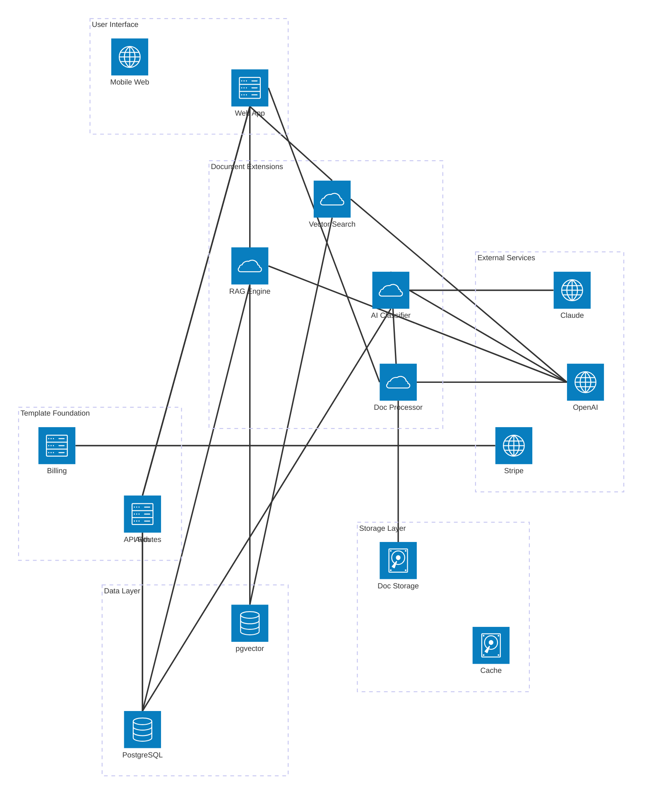
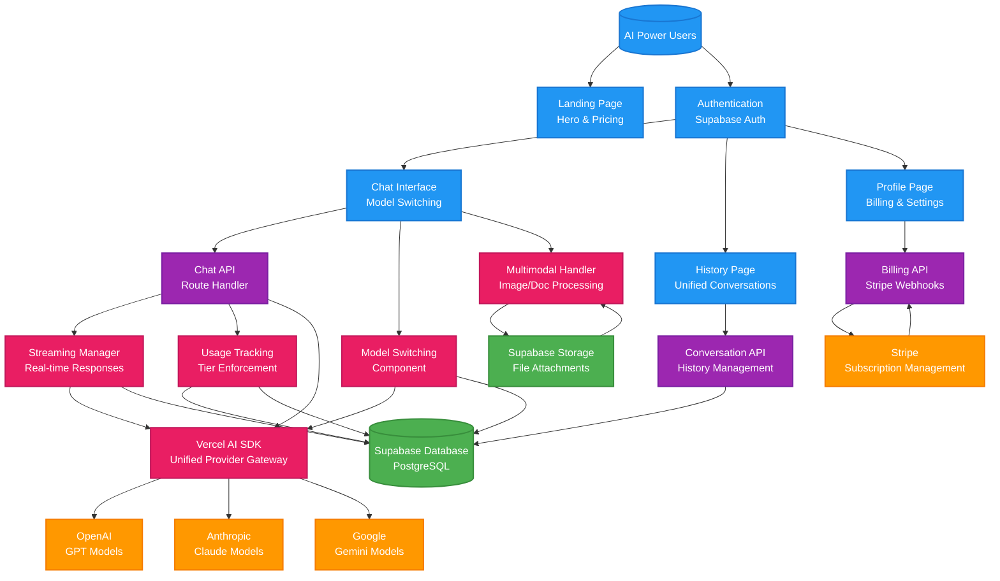

# System Architecture Blueprint

## App Summary

**End Goal:** Help professionals and business owners save countless hours through AI-powered document organization and classification  
**Template Foundation:** rag-saas with Next.js, Supabase, PostgreSQL, Stripe integration  
**Core Extensions:** Document processing pipeline, vector search, RAG Q&A system

---

## 🏗️ System Architecture Diagram

### Filyx.ai Document Management Platform Architecture

---

## 🎯 Architecture Strategy

### Template Foundation Leverage

**✅ What Your rag-saas Template Already Provides:**
- **Next.js Web Application** - Complete user interface with all pages (dashboard, upload, documents, search, settings)
- **Supabase Authentication** - User registration, login, password management, session handling
- **API Routes Foundation** - Backend endpoints for user actions and data management
- **Stripe Integration** - Subscription management for Free ($0), Professional ($19.99), Business ($49.99) tiers
- **PostgreSQL Database** - Core database with complete schema for users, documents, categories, classifications
- **File Storage Infrastructure** - Supabase storage for document uploads and management
- **Responsive Design** - Tailwind CSS with mobile-optimized interfaces

### Strategic Extensions Required

**⚡ Document Processing Pipeline:**
- **Document Processor Service** - Handles multi-format uploads (PDF, images, audio, video), validates files, initiates processing workflows
- **AI Classification Service** - Analyzes document content and assigns categories with confidence scoring using GPT-4/Claude
- **OCR & Text Extraction** - Extracts text from images and PDFs for classification and search indexing
- **Metadata Processing** - Extracts document properties, creation dates, author information for enhanced organization

**🔍 Vector Search & RAG System:**
- **Vector Search Service** - Converts documents to embeddings using OpenAI text-embedding-ada-002, stores in PostgreSQL pgvector
- **RAG Q&A Engine** - Powers "Ask AI" feature with document-cited responses, semantic search across document collections
- **Hybrid Search Implementation** - Combines full-text search with vector similarity for optimal retrieval accuracy
- **Citation Management** - Links AI responses to specific document sections and pages for transparency

---

## 🔧 Key Architectural Decisions

### Decision 1: PostgreSQL + pgvector for Vector Storage
**Rationale:** Unified database approach reduces complexity and operational overhead
- **Advantages:** Single database to manage, ACID transactions, established backup/recovery procedures
- **Trade-offs:** May require migration to dedicated vector DB at very large scale (1M+ documents)
- **Scaling Path:** Monitor query performance, implement sharding by user if needed, ready migration to Pinecone/Weaviate

### Decision 2: Microservices for Document Processing
**Rationale:** Resource-intensive processing needs independent scaling and fault isolation
- **Architecture:** Separate Cloud Run services for classification, OCR, vector generation
- **Benefits:** Scale processing independently, isolate failures, optimize costs per operation
- **Implementation:** API-first design with clear service boundaries and error handling

### Decision 3: Multi-AI Provider Strategy
**Rationale:** Cost optimization, redundancy, and model-specific optimization
- **Provider Allocation:** Claude for classification (cost-effective), GPT-4 for Q&A (higher quality)
- **Fallback Strategy:** Automatic failover between providers, cost-based routing
- **Future-Proofing:** Service layer abstracts providers, easy to add new models or switch based on performance

### Decision 4: Hybrid Search Implementation
**Rationale:** Combine full-text and semantic search for optimal user experience
- **Full-Text Search:** Fast keyword matching, exact phrase searches, boolean queries
- **Vector Search:** Semantic similarity, concept matching, cross-language understanding
- **Hybrid Approach:** Score combination with user preference learning and result ranking optimization

---

## 🚨 Risk Assessment & Mitigation Strategies

### High Priority Risks

**Risk 1: AI Processing Costs at Scale**
- **Problem:** Document classification and vector generation costs grow linearly with usage
- **Impact:** High AI API costs could erode profit margins, especially on lower-tier plans
- **Mitigation Strategies:**
  - Implement strict usage limits per subscription tier (Free: 100 docs, Professional: 5K, Business: unlimited)
  - Cache classification results to avoid reprocessing similar documents
  - Batch processing for non-urgent operations to optimize API costs
  - Monitor per-user processing costs with automated alerts for unusual usage patterns
- **Success Metrics:** AI costs < 30% of revenue per user, processing cost per document trending down

**Risk 2: Vector Search Performance Degradation**
- **Problem:** PostgreSQL pgvector performance may degrade with millions of documents and concurrent users
- **Impact:** Slow search results hurt user experience, especially for real-time Q&A features
- **Mitigation Strategies:**
  - Implement proper vector indexing (IVFFlat) with regular index maintenance
  - Monitor query performance with automated alerting for response times > 2 seconds
  - User-based data sharding to distribute load across database instances
  - Ready migration path to dedicated vector databases (Pinecone, Weaviate) if needed
- **Success Metrics:** Search queries < 1 second 95th percentile, Q&A responses < 3 seconds

### Medium Priority Risks

**Risk 3: Document Storage Cost Growth**
- **Problem:** File storage costs grow with user adoption and document retention policies
- **Impact:** Storage costs could become significant operational expense as user base scales
- **Mitigation Strategies:**
  - Enforce storage quotas per tier (Free: 1GB, Professional: 10GB, Business: 100GB+)
  - Implement document lifecycle policies with automatic archival of old documents
  - Compress older documents and use tiered storage (frequent access vs archive)
  - Monitor storage growth rates and optimize based on usage patterns
- **Success Metrics:** Storage costs < 10% of revenue, average storage per user within tier limits

**Risk 4: RAG Response Quality Issues**
- **Problem:** Poor document citations or irrelevant answers damage user trust and retention
- **Impact:** Low-quality AI responses reduce feature adoption and user satisfaction scores
- **Mitigation Strategies:**
  - Implement confidence thresholds with "not sure" responses for low-confidence queries
  - User feedback loop with thumbs up/down on AI responses for continuous improvement
  - A/B testing different retrieval strategies and response generation approaches
  - Manual review process for flagged low-confidence responses
- **Success Metrics:** User satisfaction > 4.0/5.0 for AI responses, <5% low-confidence responses

---

## 📈 Implementation Roadmap

### Phase 1: MVP Foundation (Weeks 1-2)
**Goal:** Launch basic document management with AI classification

**Core Features:**
- Document upload with format validation (PDF, images, basic text files)
- AI-powered classification using GPT-4 with confidence scoring
- Basic category management (system categories + custom user categories)
- PostgreSQL full-text search for document content
- User authentication and subscription tier enforcement
- Stripe integration for payment processing

**Success Criteria:**
- Users can upload and classify 100+ documents
- Classification accuracy > 85% for common business document types
- Search returns relevant results in < 2 seconds
- Payment flow complete for all three subscription tiers

### Phase 2: Vector Search & RAG (Weeks 3-4)
**Goal:** Add semantic search and document Q&A capabilities

**Advanced Features:**
- PostgreSQL pgvector integration with OpenAI embeddings
- Semantic search with hybrid full-text + vector approach
- RAG-powered Q&A with document citations
- Enhanced document processing pipeline (OCR, metadata extraction)
- Performance optimization and query response time improvements

**Success Criteria:**
- Semantic search finds conceptually similar documents
- Q&A provides accurate answers with proper document citations
- Vector search completes in < 1 second for typical queries
- Document processing handles 95% of uploaded file formats

### Phase 3: Scale & Optimization (Weeks 5-6)
**Goal:** Production-ready performance and advanced features

**Optimization Features:**  
- Search analytics and user behavior tracking
- Advanced classification rules and custom categories
- Bulk document operations and batch processing
- Performance monitoring and automated scaling
- User feedback integration and response quality improvement

**Success Criteria:**
- System handles 100+ concurrent users without performance degradation
- AI processing costs optimized to < 30% of user revenue
- User satisfaction scores > 4.0/5.0 for core features
- Ready for public launch with growth marketing campaigns

---

## 🛠️ Technology Stack Summary

### Frontend Layer
- **Next.js 14+** - React framework with App Router, server components, optimized performance
- **Tailwind CSS** - Utility-first styling with custom design system and responsive components
- **TypeScript** - Type safety for better developer experience and reduced runtime errors

### Backend Layer
- **Next.js API Routes** - Serverless functions for business logic and external service integration
- **Supabase** - Backend-as-a-Service for authentication, database, and file storage
- **PostgreSQL + pgvector** - Primary database with vector search capabilities

### AI & Processing
- **OpenAI API** - GPT-4 for classification and Q&A, text-embedding-ada-002 for vectors
- **Anthropic Claude** - Alternative classification provider for cost optimization and redundancy
- **Cloud Run Services** - Containerized microservices for document processing and AI operations

### Infrastructure
- **Vercel** - Next.js deployment with edge functions and global CDN
- **Google Cloud Platform** - Cloud Run for processing services, Cloud Storage for file backup
- **Stripe** - Payment processing, subscription management, usage-based billing

### Monitoring & Operations
- **Vercel Analytics** - Performance monitoring and user behavior tracking
- **Sentry** - Error tracking and performance monitoring for production debugging
- **Google Cloud Monitoring** - Infrastructure monitoring and alerting for processing services

---

## 🎯 Architecture Success Metrics

### Performance Targets
- **Document Upload:** < 5 seconds for files up to 50MB
- **AI Classification:** < 10 seconds for typical business documents
- **Search Queries:** < 1 second for full-text, < 2 seconds for semantic search
- **Q&A Responses:** < 3 seconds for RAG-powered answers with citations
- **Page Load Times:** < 2 seconds for all application pages

### Quality Targets
- **Classification Accuracy:** > 85% for common business document types
- **Search Relevance:** > 90% user satisfaction with search results
- **Q&A Accuracy:** > 80% helpful responses based on user feedback
- **System Uptime:** > 99.5% availability for core application features

### Business Targets
- **User Onboarding:** < 5 minutes from signup to first document classified
- **Feature Adoption:** > 70% of users try Q&A feature within first week
- **Subscription Conversion:** > 15% free to paid conversion within 30 days
- **Cost Efficiency:** AI processing costs < 30% of user subscription revenue

This architecture provides a solid foundation for building Filyx.ai while maintaining simplicity, cost-effectiveness, and clear scaling paths as your user base grows.

## 🏗️ System Architecture

### Architecture Diagram

### System Flow Explanation

**User Journey**
AI power users access the platform through the landing page, authenticate via Supabase Auth, and primarily interact through the Chat Interface where they can seamlessly switch between AI models. They manage conversation history through the History page and handle billing/settings through the Profile page.

**Data Flow**
User messages flow from Chat Interface → Chat API → Model Switching Component → Vercel AI SDK → Selected AI Provider. Responses stream back through the same path while Usage Tracker records consumption and Streaming Manager handles real-time delivery. All conversations and messages persist to Supabase Database with model attribution preserved.

**Key Integrations**
- **Supabase Auth** provides secure user authentication and session management
- **Vercel AI SDK** serves as unified gateway to OpenAI, Anthropic, and Google AI providers
- **Stripe** handles subscription lifecycle, billing webhooks, and tier enforcement
- **Supabase Storage** manages multimodal file attachments (images, documents)

**Custom Components**
- **Model Switching Component** enables seamless provider changes within conversations
- **Usage Tracking System** enforces tier limits and monitors consumption patterns
- **Streaming Manager** handles real-time AI responses with proper interruption controls
- **Multimodal Handler** processes image and document uploads for AI analysis

---

## ⚠️ Technical Risk Assessment

### ✅ Low Risk (Template Handled)
- User authentication and session management (Supabase Auth)
- Database operations and connection pooling (Supabase PostgreSQL)
- Payment processing and webhook handling (Stripe integration)
- File storage and CDN delivery (Supabase Storage)
- Basic conversation and message persistence (existing schema)

### ⚠️ Medium Risk (Monitor These)
- **AI Provider Cost Management** - Different pricing models across OpenAI, Anthropic, Google
- **Multimodal File Processing** - Ensuring images/documents don't impact chat performance
- **Model Availability Management** - Graceful handling of provider outages or deprecations

### 🔴 High Priority (Address Early)
- **Database Schema Updates** - Fix subscription tier enums from [free, basic, pro] to [free, pro, premium]
- **Model Access Control** - Update ai_models table to support 3-tier access (free/pro/premium models)

---

## 🏗️ Implementation Considerations

### Required Architectural Components
- **Model Switching Component** with database-driven configuration and real-time state management
- **Vercel AI SDK Integration** as unified provider gateway with error handling and streaming support
- **Usage Tracking System** with tier-based enforcement and consumption monitoring
- **Enhanced Streaming Manager** with proper interruption controls for model switching
- **Database Schema Migrations** to align subscription tiers and model access control

### Optional System Enhancements
- **Advanced Usage Analytics** with detailed consumption reporting and cost optimization insights
- **Model Performance Monitoring** with provider availability tracking and automatic failover
- **Enhanced Admin Dashboard** with advanced model management and user analytics
- **Conversation Export System** with PDF/Markdown export and model attribution

### Database Architecture Changes
- Update `users.subscription_tier` enum from ["free", "basic", "pro"] to ["free", "pro", "premium"]
- Modify `ai_models.is_premium_model` to `access_tier` enum supporting ["free", "pro", "premium"]
- Ensure existing conversation and message tracking supports model attribution
- Verify usage tracking tables align with new subscription tier structure

### External Service Integration
- **Vercel AI SDK** as primary integration point for OpenAI, Anthropic, and Google providers
- **Stripe** for subscription management, billing webhooks, and tier enforcement
- **Supabase Storage** for multimodal file handling with async processing
- **Individual AI APIs** as fallback options for advanced features if needed

### Performance & Scaling Architecture
- Database indexing on conversation and message queries with model filtering
- Efficient streaming architecture with proper memory management for long conversations
- Usage tracking optimization to prevent blocking legitimate user interactions
- File processing pipeline that maintains responsive chat interface performance

---

## 🛠️ Implementation Strategy

### Phase 1 (MVP Foundation)
- **Database Schema Updates**: Fix subscription tier enums and model access control
- **Model Switching Component**: Core architecture for seamless provider switching within conversations
- **Vercel AI SDK Integration**: Unified gateway setup for OpenAI, Anthropic, and Google providers
- **Usage Tracking System**: Tier-based consumption monitoring and enforcement logic
- **Streaming Manager**: Real-time response handling with proper interruption controls
- **Basic Multimodal Support**: Image and document upload through Supabase Storage

### Phase 2 (Enhanced Features)
- **Advanced Usage Analytics**: Detailed consumption reporting and cost optimization insights
- **Enhanced Multimodal Processing**: Advanced document analysis and image processing workflows
- **Model Performance Monitoring**: Provider availability tracking and automatic failover logic
- **Conversation Export System**: PDF and Markdown export functionality with model attribution
- **Admin Dashboard Enhancements**: Advanced model management and user analytics

### Architecture Guidelines
- **Template Foundation**: Leverage existing chat-saas authentication, billing, and conversation management - don't rebuild these systems
- **Custom Development**: Focus development effort on Model Switching Component and Vercel AI SDK integration - these are your unique differentiators
- **Integration Strategy**: Start with Vercel AI SDK as primary integration point, add individual provider fallbacks only if needed for advanced features
- **Data Flow Priority**: Ensure model attribution is captured at every message level for accurate usage tracking and conversation restoration
- **Performance Approach**: Keep model switching instant by maintaining conversation state in database, not in memory

---

## 🎯 Success Metrics

This system architecture supports your core value proposition: **Seamless and flexible access to multiple AI models within a single chat interface**

**MVP Success:** Your architecture will support seamless model switching, unified conversation history across providers, multimodal support, and subscription tier management
**Scalability Ready:** System can grow to support advanced analytics, conversation templates, API access, and voice capabilities
**Template Optimized:** Leverages existing chat-saas foundation while enabling your unique AI model switching vision

> **Next Steps:** Ready for implementation with this complete system architecture blueprint
